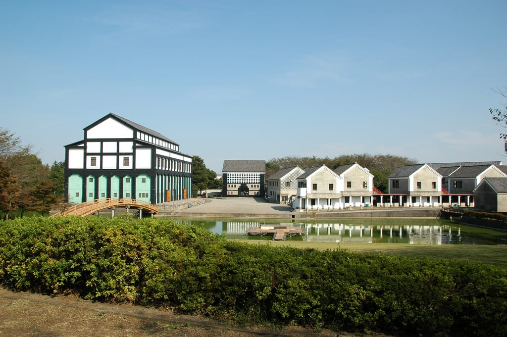
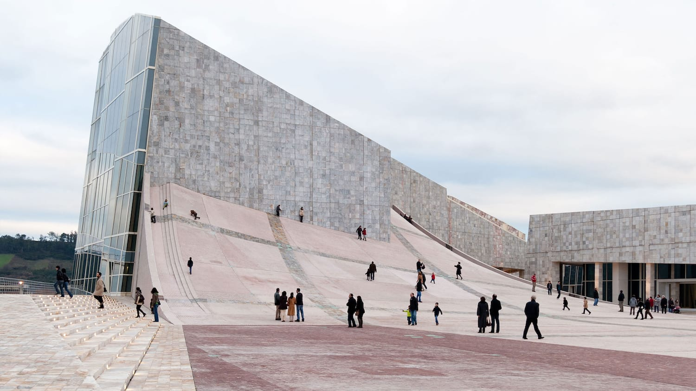

This is a part 1 in a series I'm calling "responses to things I read."

I spent a couple hours browsing through [Nathan J. Robinson](https://twitter.com/NathanJRobinson)'s articles [Current Affairs](https://www.currentaffairs.org) and came across [_Why You Hate Contemporary Architecture_](https://www.currentaffairs.org/2017/10/why-you-hate-contemporary-architecture). 

Robinson summarizes that we stopped building beautiful buildings once architects rejected ornament ("a sign of bourgeois decadence and cultural indulgence"), and saw transcendently “beautiful” architecture as ludicrous in a postwar world of chaos, conflict, and alienation. Armed with these new ideas, architects tried to express the often ugly, brutal, and difficult facts of human beings' material existence through their buildings.

The article then links to ["an infamously heated 1982 debate at the Harvard School of Design](http://www.katarxis3.com/Alexander_Eisenman_Debate.htm) between two architects, [Peter Eisenman](https://en.wikipedia.org/wiki/Peter_Eisenman) and [Christopher Alexander](https://en.wikipedia.org/wiki/Christopher_Alexander)". (I've been increasingly interested in [Christopher Alexander](https://en.wikipedia.org/wiki/Christopher_Alexander) -- while his work is explicitly about architecture, it also has broader political implications, and, perhaps suprisingly, is relevant to software engineering (the idea of patterns in software come from him).)

The debate presents a suprisingly-easy-to-follow juxtaposition: in one corner (Alexander) we have the architecture of Comfort, Order, and Harmony, and in the other (Eisenman) we have its foil of Discomfort, Disorder, and Disharmony.

Alexander's Eishin Campus from [Flickr user Kakeda](https://www.flickr.com/photos/kakeda/sets/72157622334241919/)

Eisenman's [City of Culture of Galicia](https://en.wikipedia.org/wiki/City_of_Culture_of_Galicia)

Early in the debate, Eisenman tries to simply attribute their difference in ideas by invoking the [Jungian cosmology](https://en.wikipedia.org/wiki/Self_in_Jungian_psychology): "you may be a feeling type and I may be a thinking type." Alexander rejects this, arguing that an individual architect's disposition should be independent of the goals of architecture. Alexander declares the singular purpose of an architect is to make their buildings "feel absolutely comfortable -- physically, emotionally, practically, and absolutely."

Leaning on "[post-structuralists](https://en.wikipedia.org/wiki/Post-structuralism)," Eisenman argues that his buildings are a necessary complement to Alexander's comfortable buildings:

> "If you repress the destructive nature, it is going to come out in some way. If you are only searching for harmony, the disharmonies and incongruencies which define harmony and make it understandable will never be seen. A world of total harmony is no harmony at all. Because I exist, you can go along and understand your need for harmony."

Alexander wholesale rejects this notion -- to him, Harmony is "a simple objective matter." I find [Lucien Steil](https://architecture.nd.edu/faculty/lucien-steil/)'s comments on this particularly interesting:

> "The debate is, therefore – despite the title given to it at the time, of "Discord Over Harmony in Architecture" – more about Order than Harmony: Foucault's [Order of Things](https://en.wikipedia.org/wiki/The_Order_of_Things) vs Alexander's [Nature of Order](https://en.wikipedia.org/wiki/The_Nature_of_Order). On the one hand we have Order presented as something subjective, socially-constructed, with the flavour of repression about it, and on the other Order as something objective, a fundamental property of matter, something essentially generative. Alexander was convinced, as he had been for twenty years – well before Eisenman got into bed with any "nuova scienza" – that Order and Harmony were both objective facts, susceptible to scientific method, and, since the debate took place, a number of scientists have begun to come around to this same position. By contrast, [Derrida](https://en.wikipedia.org/wiki/Jacques_Derrida)'s use of science has now been classed among the [Intellectual Impostures](https://en.wikipedia.org/wiki/Fashionable_Nonsense), so here in the debate we see the early stages of the inevitable clash between real science and voodoo science in architecture."

So, if "real science" has in fact ruled in favor of Order as objective, Alexander seems to be the clear winner of the debate. But what if the opposite were true? 

Would we need to introduce disharmony to our built environment to fully understand harmony? Could architects like Alexander actually learn about harmony from Eisenman? In the name of progress, should we provoke anxiety in all city dwellers by adding massive, sterile buildings to our skyline? 

Eisenman and his elitism say yes, but to me, it feels pretty gross and paternalistic to say that stirring up anxiety in the public is beneficial, whether people can recognize it or not. It seems like Eisenman wants people to feel alientated by his buildings, and wants them to identify similar feelings in everyday life. These people would then, presumably, want to do something about it: fix society and tear down these buildings. 

Eisenman's life work feels like an entirely unnecessary step: if we want a happier and more harmonious society, why not start building towards it immediately? Is there not enough anxiety already in the world to motivate change?
