I found this article on the _New York Magazine_'s [website](http://nymag.com/arts/architecture/features/49959/) when researching the recent architectural changes in NYC. The article reads as balanced, ultimately concluding that "the [building] boom has left us a better town." 

While written just over a decade ago, it especially struck a chord with me as I can see some of the buildings from my own apartment: namely, the Avalon Chrystie Place and the Avalon Bowery Place. These buildings never struck me as well designed, and the huge `no fee luxury apartment` banners permanently affixed to their exterior feel distateful. But I never knew how important these buildings were in kickstarting the neighborhood's revitalization over the past 15 years or so. 

Davidson's thoughts on gentrification are fairly terse, and he (perhaps loosely) implicitly defines gentrification as anything that makes a neighborhood fancier: "Gentrification eddies across the city, polishing formerly middle-class enclaves to an affluent shine, prettying up once-decrepit neighborhoods for new middle-class arrivals, and making awful slums habitable." In particular, he has mixed opinions on the gentrification brought on by the Avalon buildings ("but couldn’t class warfare be waged with better design?"). Still, he rejects nostalgia for nostalgia's sake (i.e., let's not fetishize the misery of LES tenements), but thinks we should "mitigate [gentrification's] impact on the poor through activism, governance, and good design." But activism and governance are very much outside the scope of this piece.

The before-and-after photos were essential, and (note to self) I think there's potentially a really cool opportunity to use Google Street View to make this article more interactive.

Relating this back to the [Alexander-Eisenman Debate](/alexander-eisenman-debate/), I wonder if Alexander would approve of any glass-heavy buildings -- is a lot of glass (at least plain, unspectacular glass) always uncomfortable and alienating? Alexander also advocates that buildings top out at three or four stories -- what would New York look like today if builders of the 2000s took him up on his advice?

The article was spread across [twenty three pages](http://nymag.com/arts/architecture/features/49959/) (it was originally published on September 7, 2008... we sure have gotten better at online readability in the last ten years). For those interested, I did my best to combine the article into one page below.

---

## The Glass Stampede

_As this last great building boom winds down, our architecture critic asks: Does the new see-through city look better or worse than the one it replaced? A building-by-building survey._

By [Justin Davidson](http://nymag.com/nymag/justin-davidson)

Our city is molting.

Bricks flake away. So do brittle fire escapes, terra-cotta encrustations, old paint, cracked stoops, faded awnings, sash windows, and stone laurels fashioned a century ago by Sicilian carvers. New York is shucking off its aging walk-ups, its small and mildewed structures, its drafty warehouses, cramped stores, and idle factories. In their place, the city is sprouting a hard, glistening new shell of glass and steel. Bright, seamless towers with fast elevators and provisional views spring up over a street-level layer of banks and drugstores. In some cities, a building retains the right to exist until it’s proved irredeemable. Here, colossal towers are merely placeholders, temporary arrangements of future debris. New York lives by a philosophy of creative destruction. The only thing permanent about real estate is a measured patch of earth and the column of air above it. The rest is disposable.

And the metamorphosis has sped up. In the past fifteen fat years, more than 76,000 new buildings have gone up, more than 44,000 were razed, another 83,000 were radically renovated—a rate of change that evokes those time-lapse nature films in which flowers spring up and wither in a matter of seconds. For more than a decade, we have awakened to jackhammers and threaded our way around orange plastic netting, calculating that, since our last haircut, workers have added six more stories to that high-rise down the block. Now that metamorphosis is slowing as the economy drags. Buildings are still going up, but the boom is winding down. Before the next one begins is a good time to ask, has this ferment improved New York or eaten away at the city’s soul?

Some see this sustained spasm of building as an urban lobotomy, in which the city has sacrificed its eccentricities and variety to placid prosperity. I am more optimistic, but to test that feeling against unsightly reality, I decide to canvass the city, inventory the construction that so many New Yorkers revile, and see what is worth defending. The results of my tour (or 54 side-by-side comparisons, at least) appear on these pages. Half a century ago, similar upheavals resulted from urban-renewal campaigns and social housing planted on the scale of midwestern corn. This time the boom has happened lot by lot. I see single-family houses on Staten Island and a vertical metropolis at Columbus Circle, juice-carton towers and displays of virtuoso design. In some cases, the same architects have built for sybarites (Polshek Partnership’s Standard Hotel, which stands, Colossus-like, astride the High Line) and for the low-income, elderly, and disabled (Polshek’s Schermerhorn House in Brooklyn). I hear the wails of those who mourn the city they knew decades, years, or weeks ago, but I come away satisfied that the boom has left us a better town.

**1. 110 Third Avenue**

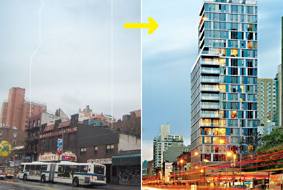

The Variety Arts Theater was an institution that seemed to spend most of its 90-year existence in a state of gentle decline. Finally razed in 2004, it gave birth to Greenberg Farrow’s impressively awful tower, full of fussy fenestration and clutter. A real loss.

I start my peregrinations at the corner of Bowery and Houston Street, which has rolled over from a rank and raffish past to a more sedate kind of glumness. Here, in the last few years, graffiti-encrusted storefronts have made way for a pair of hulking rental boxes by the suburban developer AvalonBay Communities. On the south side of Houston is the company’s first Manhattan beachhead, Avalon Chrystie Place, which is marginally edgier than its usual pabulum. Paired with SLCE, Arquitectonica, the firm that brought you the gaudy Westin hotel in Times Square, has restrained itself to the point of invisibility, giving the façade a smattering of texture that does little to lighten the dumpy massing. A vast Whole Foods took most of the retail space, confirming fears of a middle-class takeover of the Lower East Side: The tofu’s fine and the living is easy, but couldn’t class warfare be waged with better design?

Leaping across Houston Street, AvalonBay leveled McGurk’s, a rickety five-story dive that in the 1890s employed whores so desperate that the place came to be known as Suicide Hall. The glass block that went up instead—Avalon Bowery Place—might not oppress its residents quite that much, but its aggressive blandness has a way of chipping at the soul. A gimcrack look is nearly all that connects the reflective interloper to the dark, medieval dwellings all around. You don’t have to be ancient to remember the Bowery’s concordance of ravaged masonry and human ruins, who tottered from flophouse to dive to doorway. Now the closest thing to a den of sin is Bruce Willis’s wine bar, Bowery Wine Company, which a few dozen neighbors welcomed with placards that read `DIE HARD YUPPIE SCUM`. The National Trust for Historic Preservation tried more-genteel tactics: It has put the area on its list of “Most Endangered Historic Places.”
As I make my way up the new boulevard of Bowery toward the de-punked East Village, I think about the trade-offs. As the grandchild of Lower East Side tenement dwellers, I sympathize with preservationist sentiments. We need to remember, if not actually to relive, the experience of this once colorfully impoverished neighborhood. And yet it’s one thing to preserve the traces of history, as the Lower East Side Tenement Museum does; it’s another to fetishize misery. This slum sucked in huddled masses who craved less putrid air, more abundant food, and a little more space between one person and the next. Is it right to romanticize what they wanted desperately to escape? Hasn’t the birthplace of Gertel’s and Katz’s earned itself a place to buy organic spelt? Avalon’s ersatz châteaux could have been more graceful, but is the transformation they’ve helped to wreak really so dismal? Bad architecture can be good for people, too.

**2. Avalon Bowery Place**

11 and 22 East 1st Street

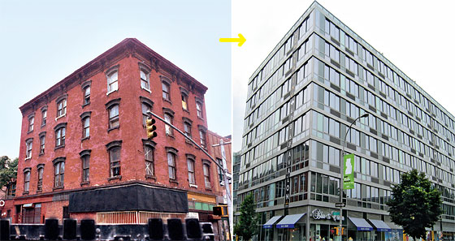

The developer AvalonBay paired Arquitectonica with SLCE, hoping the two firms would cook up something spirited. What we got is pretty blah, but not without traces of urbanistic merit, thanks to a community garden on one side and a suggestive alleyway on the other. A poor replacement, even for just tenements.

Think of the alternatives. In the last 25 years, the city’s population has increased by a million people, and another million will be here 25 years from now. The question is not whether to make room for them but how. We could, in theory, rope off most of Manhattan to new development and push new arrivals to the city’s fringes. Had we done that years ago, we would have created a museum of shabbiness. Even doing so now would keep the city in a state of embalmed picturesqueness and let the cost of scarce space climb to even loonier heights than it already has. In its 43-year existence, the Landmarks Preservation Commission has tucked more than 25,000 buildings under its protective wing, which seems about right. Protect every tenement, and eventually millionaires can no longer afford them.

An abundance of new architecture comes with a concomitant amount of demolition, which is not necessarily a bad thing. The most admired, most architecturally resplendent cities are the products of major destruction: Paris, gutted by Baron Haussmann in the mid-nineteenth century, Chicago and London, leveled by fire; Rome, radically reorganized by Pope Sixtus V in the late 1580s; San Francisco, flattened by an earthquake in 1906. I’m not advocating growth through trauma, only pointing out that periods of rapid change can be spectacularly constructive and that the results outlast the pangs. As pieces of the city evaporate, they take our memories with them. It gets hard to remember which block that old Chock Full o’Nuts was on or what was next to a lamented laundromat. This chronic amnesia is part of the New York condition. In his 1962 poem “An Urban Convalescence,” James Merrill captured the feverish yet methodical sacking of the city and the way it toys with our sense of comfortable familiarity.

<blockquote>

As usual in New York, everything is torn down

Before you have had time to care for it.

Head bowed, at the shrine of noise, let me try to recall

What building stood here. Was there a building at all?

</blockquote>

Among Merrill’s disciples is one Jeremiah Moss, who maintains the engagingly gloomy blog Jeremiah’s Vanishing New York, which he terms “an ongoing obituary for my dying city.” His topic is the steady erosion of the city’s texture. He is the defender of all the undistinguished hunks of masonry that lend the streets their rhythm and give people a place to live and earn a living: bodegas, curio stores, a metalworking shop in Soho, diners, and dingy bars.

The jaundiced view of the Lower East Side is that it can no longer be rescued from the sneaker boutiques, the bulbous Blue condo, or the guests at the Hotel on Rivington who sit at the bar and gaze at the diorama of quaint old tenements. But we should put this transformation in context. A century ago, when the neighborhood was among the most congested places on Earth, New York kept bounding beyond its three-dimensional borders. By the city’s own standards, the current spasms of construction are not really so severe. What makes the current escalation feel so sharp is that it comes after a long period of decline. The fortysomething who grew up here knew a metropolis that was not just smaller but rapidly desiccating. Between 1970 and 1980, more than a million people leached out of the five boroughs, their numbers only partially offset by new immigrants and aspiring actors. Crime rose, property prices collapsed, and plenty of smart people began to write New York off as another Newark, Cleveland, or Detroit.

Urban nostalgists reserve their greatest animus for gentrification, which is a stark word for a complicated phenomenon. It does not describe only the relentless territorial expansion of the rich at the expense of everybody else: Gentrification eddies across the city, polishing formerly middle-class enclaves to an affluent shine, prettying up once-decrepit neighborhoods for new middle-class arrivals, and making awful slums habitable. In the intricate ecology of New York, each current triggers a dizzying series of countercurrents. Low crime rates make city life more desirable, so fewer middle-class families feel like they are being forced to flee to the suburbs. That causes real-estate prices to climb, which forces out some of those same middle-class families. Rising housing costs in low-income areas require the poor to spend a growing slice of their income on rent but also make it financially feasible for developers to build affordable housing.

The way to deal with this tangle of paradoxes is not to rail against gentrification or lunge to halt it but to mitigate its impact on the poor through activism, governance, and good design. New York has the country’s largest municipal affordable-housing program, not just now but ever. It doesn’t manifest itself in jerry-built towers of despair, because below-market housing is often mixed with the expensive kind; a quarter of the apartments in the Avalon complex are reserved for low-income families. That kind of housing, too, can rescue a neighborhood. The needle-strewn South Bronx seemed beyond redemption until a collective of developers, nonprofits, and city agencies built Melrose Commons, a low-rise, low-income housing complex that is safe, durable, and appealing. That, too, is gentrification.

**3. New 42nd Street Studios**

229 West 42nd Street

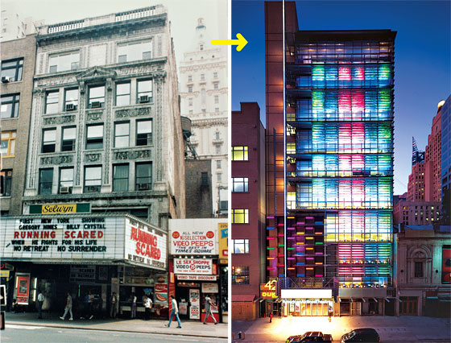

The currency of Times Square has always been razzle-dazzle, but until 42nd Street’s magical overhaul, it was mostly ginned up by tired marts and screeching signs. Platt Byard Dovell’s rehearsal studios found a more refined way to be brassy. At night, the outer skin of metal slats—little screens, really, for the play of colored lights—performs an electric dance. More than makes up for the departed Selwyn Theater.

Do the dedicated yearners who would roll back this tide look fondly on the charred South Bronx of the eighties? Would they stick by the most depressed and derelict expanses of Brooklyn, or the cracked-out squats around Tompkins Square Park, or the blocks of boarded-up windows in Harlem? That New York was not authentic or quaint; it was miserable and dangerous.

Intelligent preservation is precious, but nostalgia is cheap, and every era nurtures its own variety. Those late-nineteenth-century Upper West Siders who still thought of Broadway as the bucolic, elm-lined Bloomingdale Road of their youths resented the incursion of brownstones in the 1880s. Their children must have been horrified in turn when those same houses were wiped away by the now-classic apartment buildings that line West End Avenue. Bitterness springs eternal. So rail, if you must, at the forest of mediocrities sprouting furiously in every Zip Code, at the way they bleach out character and promote a bland parade of chain stores. But keep in mind that when all those buildings have begun to age, the architecture of our immediate future will get down to the task of becoming the past.

It would be wonderful if we could stem the Avalonization of New York simply by demanding better buildings. (Good Design Now!) The power to do that lies in the hand of the client at the top of the consumer chain, especially the condo buyer. We might wish that an aesthetically enlightened branch of government would commission masterpieces and mandate design standards for everyone else, but this is New York, where an adversarial system bludgeons designs into a collection of compromises. Craving a visionary government with the leeway to reshape large swaths of the city means forgetting a time when bureaucrats and politicians garlanded the Lower East Side with grim brown housing projects and Robert Moses smashed neighborhoods to ram highways through. To give officials such Sim City powers again would violate the spirit of New York, which since the days of the Dutch East India Company has evolved a sophisticated mechanism of controlled venality: Government sets the terms; developers take the risks. This partnership between public and private spheres is ancient and, for all its flaws, corruption, and obstacles to excellence, has nevertheless built a very fine city. The great advantage to top-down planning is that it can hatch and act on a Big Idea. It was not government alone, however, that brought Times Square back to life in the nineties; it was a convergence of planning, zoning, architecture, politics, entertainment, finance, commerce, preservation, and pure civic ambition.

If we don’t want a New York frozen in recollection, and we don’t really want politicians with the clout to strew masterpieces, then we must welcome a certain amount—okay, a large amount—of bland architecture. It’s paradoxical, I know, to wrinkle my nose at Avalon’s Bowery incursions and yet be gladdened by what they say. Much of what has gone up since the early nineties is anonymous and shoddy, but the same could be said for medieval Paris or Gilded Age Chicago—or virtually any of New York’s own glorious eras. Most architecture in any age is crap, and today’s crap isn’t as bad as yesterday’s. Fifty years ago, the sweeping attempts to house the city’s burgeoning masses produced the alpine bulk of LeFrak City and Co-op City. In their day, our generic would have been considered luxe. “When you compare these new [residential] buildings to the red-brick or white-brick apartment houses that were standard in the fifties and sixties, they’re far better,” says Alex Garvin, a planner who has been tinkering with ways to improve New York since the Lindsay years. “Both the ordinary and the exceptional have increased in quality.” One reason housing is so expensive is that even your basic rental is a better place to live.

I find myself on West 37th Street at Tenth Avenue, where a pale gray rental by Handel Architects is under construction, its tower bending into a gentle chevron above a squared-off base. “Ten years ago, the developer would have said, Why does it have to have that shape? It creates strange angles in every apartment. What’s in it for me?,” the firm’s principal Gary Handel says. “Now they understand that the formal gesture has a function on the skyline. There’s a real change in the client’s acceptance of architecture.” By which he means not high-flown architecture-as-art, but rank-and-file buildings that are better than strictly necessary.

Few architects have responded more energetically to the tumescent market, or had greater impact on the fabric of New York City, than Costas Kondylis, the prolific Greek-born master of the semi-deluxe. Like a Johnny Appleseed of real estate, Kondylis has sprinkled Manhattan with buildings such as the Lyric, on Broadway at 94th Street. The Lyric is a more or less typical specimen of New York residential architecture at the turn of the 21st century, and to anybody who had a fondness for an earlier incarnation of Upper Broadway—with its low-slung stores and ponderously corniced apartment buildings—it represented the homogenization of New York’s most motley avenue. In truth, the Lyric is neither disgraceful nor excellent; it is the soul of adequacy. Symphony Space, a performance hall colorfully and admirably renovated by Polshek, sits under the north corner like a bright block inserted in the base. Above, the 23-story tower does what the zoning says it must: rise a dozen stories to a setback before continuing on up to its allowable height. Red brick frames the obligatory picture windows, which wrap around the corners. A judicious smattering of Art Deco–ish fins makes a perfunctory nod to the glory days. The westward side of the tower extends the arms of a shallow U, offering wide-angle views of the Hudson.

**4. Porter House**

366 West 15th Street

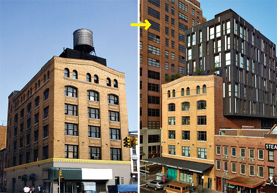

Gregg Pasquarelli’s zinc-clad beauty appears to be riding an Italianate brick warehouse like a horse, its lower stories gripping the older building’s flanks. A graceful mix of old and new, with no downside.

Pleasant to live in, harmless to the skyline, equipped with all the standard luxuries, and practically invisible to the casual glance, the Lyric is a chorus member in the opera of New York architecture. But even unradical building has a powerful effect on life at street level. As required, Kondylis lined the Broadway side with glass-faced storefronts that should in theory keep the sidewalks lively. In practice, the economics exclude small businesses with meager credit histories in favor of companies that can back up a twenty-year lease. This block has a New York Sports Club, a Commerce Bank, and a Starbucks, feeding the triumvirate of upper-middle-class needs: fitness, money, and caffeine.

Nobody flat-out hates the Lyric, whereas the nine-story Avalon Bowery Place seems more egregious. That’s partly because the Avalon flaunts its hide of metal and glass, and because its sole nod to its proletarian surroundings is in the crudeness of the design: Its curtain wall is so clumsily detailed that it appears to have been patched together out of bulletproof windows salvaged from subway token booths. To accuse a new building of being out of character with the neighborhood is the protest of first resort. But fitting in doesn’t mean blending in. Donning red-brick camouflage is a cheap and thoughtless way for a building to assimilate. Truly contextual architecture starts a conversation with the block, the street, and the city.

When that happens, it can yield greatness, and the boom has given us some of that as well. One superb example of elegant context is the fanciful riff on the glass-and-steel fish tank that Winka Dubbeldam, the principal of Archi-Tectonics, bestowed on Greenwich Street. The glass in Dubbeldam’s condo has both the liquidity of water, in ripples down the inclined façade, and the roughness and depth of masonry, which links it to the muscular workhorse buildings all around. Equally thrilling is the way the interloper throws an arm over the old brick warehouse next door, making it a partner in the block’s modernization. Now that’s how you transform a block without betraying it.

Dubbeldam’s tour de force lends strength to the idea that the context of the city places healthy constraints on artistes of unlimited imagination and equally expansive ego. “The urbanism of the city dominates architecture,” says Robert A.M. Stern, who is dean both of the Yale School of Architecture and of New York’s traditionalist wing. “The intricacies of the street wall are unending, and the edges of the parks, the streets, the squares, create amazing architecture at the urban scale. I like the fact that European architects are adjusting their techniques so that their work becomes part of the city and not just a piece of Barcelona dropped in here.”

In its awkward way, Avalon Bowery Place, too, attempts to absorb some local character. Squeezed along the Houston Street side is Liz Christy Community Garden, founded by the Green Guerrillas in the early seventies. Instead of ravaging it, Avalon paid to restore it, and it now provides a lush haven from the thundering traffic. Around the back of the building is Extra Place, an alley that served as CBGB’s vomitorium. Avalon plans to line it with stores and cafés. In their tiny way, these two scraps of land embody New York’s powerful urbanistic force.

But if Avalon Bowery Place was so keen on fitting in, what is that big glass paperweight thing doing here? The answer is that each era gives one or two materials a starring role, and our celebrity is a crystalline concoction of fused silica rolled into panes. Architects love glass for an assortment of technical reasons: It is relatively cheap, malleable, and lightweight; it can be used in tiny chips or vast sheets. It can be mounted on movable frames; it can take on a thousand forms, from the plain storefront to the baroque contortions of Gehry’s IAC headquarters. It can be environmentally virtuous by letting in more light than heat. Its delicacy can set off an assertive frame, or it can be inconspicuously clipped to a hidden structure and appear to float in midair. But the chief allure of glass in this era of deceptive exhibitionism is its usefulness in crafting illusion. A glass wall carries with it the suggestion of obviousness; it is the architectural equivalent of a magician’s rolled-up sleeve. Glass looks insubstantial and yet it keeps the weather out. It’s brittle yet remarkably immune to age; weightless yet able to carry a load; revealing as it keeps secrets. If glass has become the material of our age, it’s not because it keeps us honest but because it implies, falsely, that we have nothing to hide. The New York Times has moved from a fortress to a glass-walled headquarters, for example, but it has not for that reason become less Kremlin-like. It’s still impossible to divine what’s going on in a marriage, even if the couple lives in a zoolike pad. So the great glass wall has become an alternative to the ponderous luxuries of the prewar palais. It has also become our vernacular siding—what clapboard is to the Cape Cod saltbox.

**5. New York Times Building**

620 Eighth Avenue

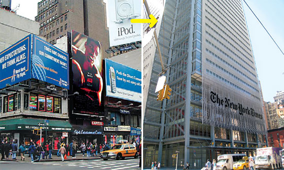

Renzo Piano’s push to put the Times on the skyline carried midtown’s energy westward and did away with a few very seedy buildings. But the building itself is a craftsmanlike tower that hits the sky with a dull thud. An improvement, but less than it should have been.

You can’t hold the material responsible for the architecture. To compare the ham-fisted use of glass by Avalon’s designers to the wizardry of Dubbeldam is almost grotesque, but they are linked because one represents the vulgarization of the other, in the same way that brick furnished forth both the tenement and the Dakota. The Dakota of glass is Richard Meier’s pair (and then trio) of condos in the West Village. When the Perry Street buildings went up in 2002, they were defiantly different from everything else in that bastion of old-time Jane Jacobean preservationism. Meier imported the pared-down, transparent office-building aesthetic of Mies van der Rohe and fused it with the sexy California aeries of Pierre Koenig, Richard Neutra, and John Lautner. The classic modernists shared a worship of visibility, but there was a huge difference in the sights they framed. In midtown, white-collar laborers toil in stacked modules, glancing out at each other from time to time. In Los Angeles and Palm Springs, residents of modern mansions gaze out on vistas of desert, city, or ocean. Meier’s Perry Street buildings attempt a compromise between proximity and panorama. They look out on drivers and joggers who gaze right back, enjoying high-def views of the inhabitants and the backs of expensive sofas.

I have mixed feelings about these apartments’ watery cool. Their austere beauty jangles with the distasteful look-at-me pose. Meier has fashioned exhibitionist paradises for the wide-screen age. Even when there’s nobody home or nothing much to see, they broadcast the illusion that the lives being led within them qualify as public spectacles. How un–New York: What’s the point of being a voyeur if everything is on display?
The glamour of living under glass spread quickly, evolving from Meier’s impractical purity into both more nuanced and more plebeian uses. The fact that the rich crave it is good, because glass is becoming an ever more complex and flexible material. So long as clients will pay to live behind it, designers will keep finding new ways to bend it, toughen it, color it, coat it, cast it, etch it, fill it with light, and bake it full of ceramic frits. Avalon Bowery Place is a by-product of the market’s boiling upper end.

So even here, standing before an icon of discontent, I am not inclined to inhale the nostalgia that thickens an atmosphere already dense with concrete dust. I am convinced that the boom has left New York better off: stronger, suppler, safer, better integrated, and better looking. Yes, it’s grown stands of interchangeable rental towers, but it’s also given Crown Heights prettier, more livable streets. The wealthy have their decorative bouquets of Tribeca condos; the commuting throngs benefit from an airy new subway terminal in Coney Island. In the rush to satisfy the voracious demand for square footage, the city has also rediscovered the pleasures of good architecture, an art that for years it had written off as a costly frill. We need new buildings just as much as we need the old. I hear in the cacophonic symphony of construction the sound of a still vigorous and hungry city. I see in all that moving of dirt and hoisting of concrete panels the New York I’ve always known: unsentimental and steadfast in its refusal to stay the same, yet vigilantly proud of its past.

**6. 25 Bond Street**

Between Bowery and Lafayette Street

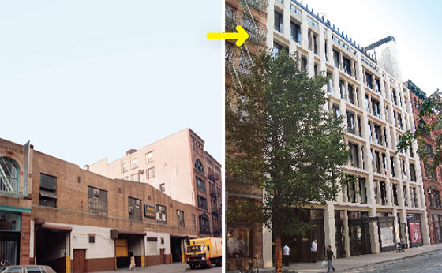

The two blocks of Bond Street have it all: antebellum gentility, nineteenth-century decrepitude, industrial energy, decay, and now extreme wealth. One of the new celebrities: BKSK Architect’s No. 25, with its softly glowing façade of blond Jerusalem stone.

**7. Palladium Residence Hall**

140 East 14th Street

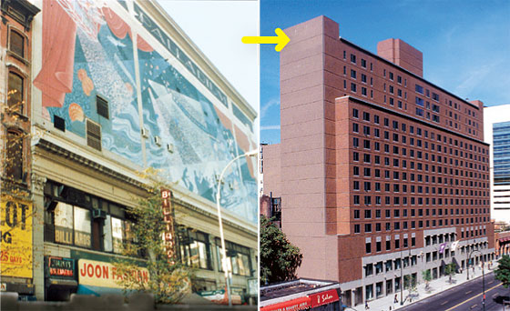

NYU’s dorm preserves the name but nothing more of its namesake concert hall turned nightspot. In place of an ecstatic mural and giant video screens, Roche Dinkeloo gave us stolid brick. Too bad, because one thing New York could use more of is good architecture of sin.

**8. Scholastic Building**

557 Broadway

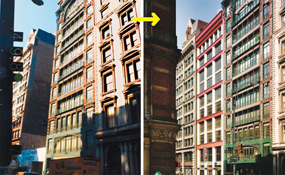

Few works of architecture offer a subtler reading of a historic New York street than Aldo Rossi’s delightful little Soho office building, wedged between cast-iron lovelies and replacing a one-story lumberyard that could only ever have been temporary.

**9. 45 Park Avenue**

At 37th Street

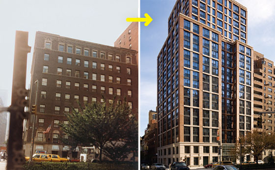

At ten stories, the solid Sheraton Russell Hotel from 1923 was a waste of air, and so it was doomed. Its replacement, a condo tower by Costas Kondylis, is neither ostentatious nor shoddy, neither short nor overbearing—a 21st-century version of the Sheraton Russell.

**10. 170 East End Avenue**

Near 88th Street

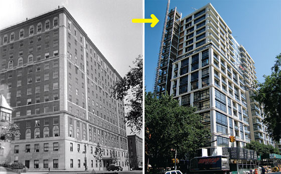

Across from Gracie Mansion, in place of the solemn brick mass of Doctor’s Hospital, Peter Marino is dressing up the classic East Side home in well-tailored, sleekly conservative garb: floor-to-ceiling windows and double-height masonry frames. The neighbors will love it.

**11. Gagosian Gallery**

554 West 24th Street

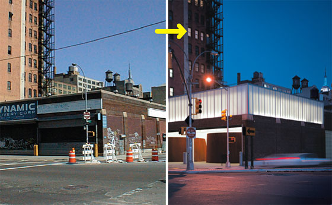

Gagosian has to accommodate the steel monoliths of Richard Serra, so architect Richard Gluckman left the former warehouse concrete-floored and bare, confining glamour to the translucent light box on top that hints at mysterious treasure inside. A nifty adaptive reuse.

**12. 15 Central Park West**

At 61st Street

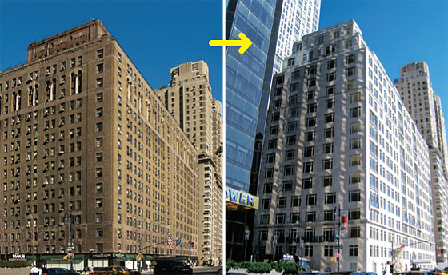

Robert A.M. Stern’s fortress of limestone luxury replaced the Mayflower Hotel, a Puritan brown cube. The new condo building is far more subtly detailed, and were it not for the fresh-plaster smell, you’d think it was from the day when the rich really knew how to build.

**13. 40 Bond Street**

Near Lafayette Street

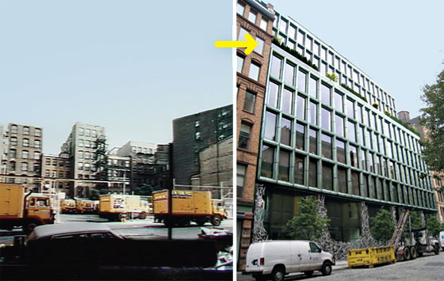

Another chic Bond Streeter, designed by Herzog & De Meuron. Bottle-green window frames surround glass with glass, and flamboyant patterns spread from the calligraphic fence to the steel panels on the façade.

**14. 8 Union Square South**

At University Place

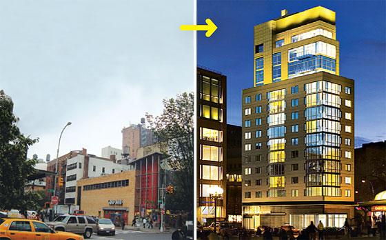

This glassy dud rises on the site of a little drama that took place in 2005 when workers pulverized a quirky glass stairwell tower in a 1949 building by Morris Lapidus—just as the Landmarks commission was issuing its protective decree. Its successor is utterly generic.

**15. Reuters Building**

3 Times Square

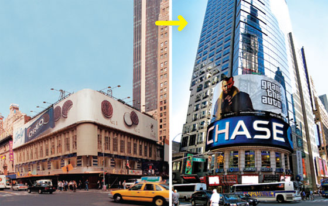

The elegant Art Deco Rialto Theatre, its façade outfitted with graceful aluminum fins, floated above a layer of tawdry storefronts. By 2001 it had all been replaced by the Reuters Building, Fox & Fowle’s ungainly collection of intersecting planes.

**16. Museum of Modern Art**

11 West 53rd Street

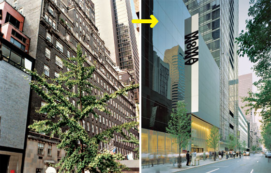

Yoshio Taniguchi quilted several of the museum’s previous versions into a spreading super-MoMA that hasn’t stopped growing yet. The density of crowd-drawing buildings irritates the neighbors, but it’s a plus for New York as a whole.

**17. The Westminster**

180 West 20th Street

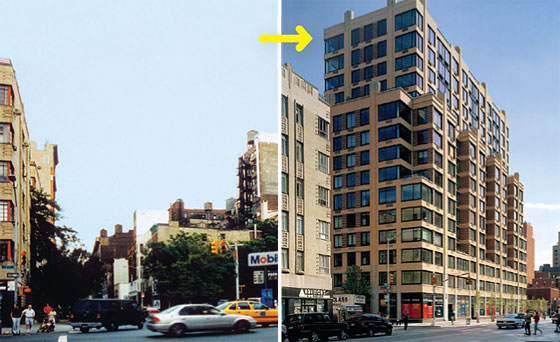

Nobody mourns a service station, and anyway, it’s hard to justify devoting a prime site in Chelsea to one, even at $6 a gallon. Robert A.M. Stern replaced it with a tasteful, neo-Deco condo in tan brick with a graceful canopy. A definite improvement, unless your tank is running low.

**18. Standard Hotel**

848 Washington Street

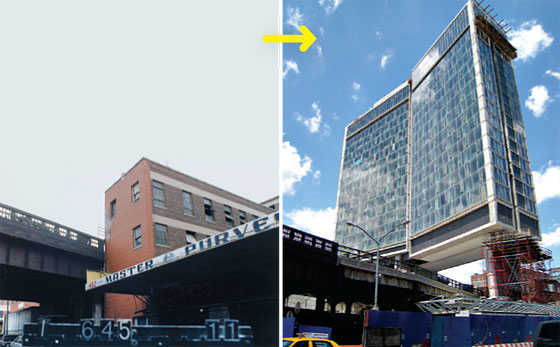

The High Line always dodged through and between buildings; now it’s gliding beneath André Balazs’s emphatically nonstandard Standard Hotel from Polshek Partnership. Few will miss that brick warehouse.

**19. Trump World Tower**

845 United Nations Plaza

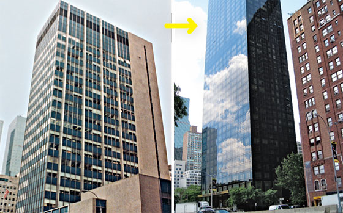

The site’s previous occupant, the 1961 Engineering Societies Center, had all the design grace of a pocket protector; the 861-foot ebony piano key that Costas Kondylis designed for Donald Trump has a certain minimalist suaveness.

**20. 173 and 176 Perry Street**

At West Street

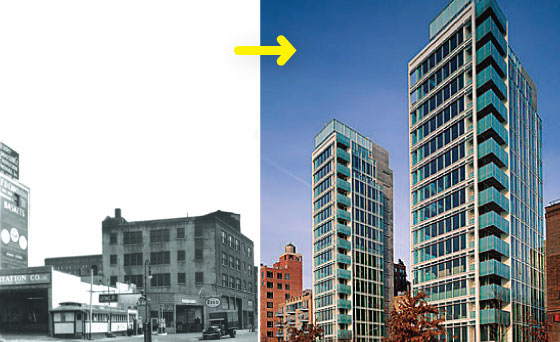

Richard Meier’s white-and-clear twin towers pierced the low-lying horizon line along West Street and launched an era of glass-walled designer condos. The transformation was inevitable; far better that the interlopers are stylish and bold rather than dumpy and self-effacing.

**21. One Astor Place**

At Lafayette Street

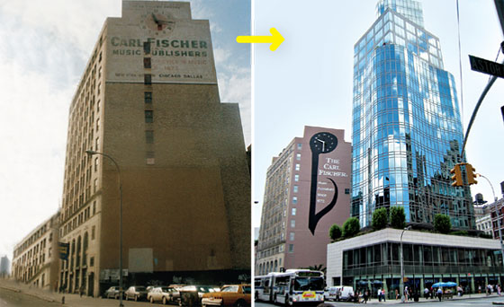

For years, the Cooper Union husbanded the parking lot at the intersection of Fourth Avenue and Lafayette Street, waiting for the right developer. Finally, the school sprang, and somehow the result is the most egregious mistake in Charles Gwathmey’s eminent career.

**22. Hotel Gansevoort**

18 Ninth Avenue

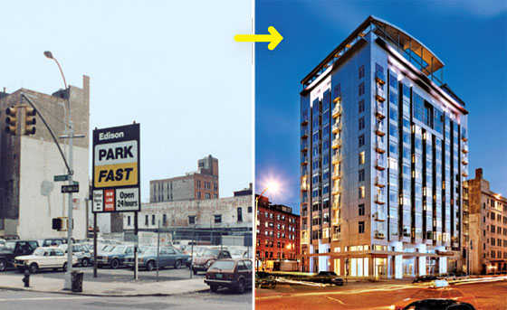

Don’t hold Stephen P. Jacobs’s big metal box responsible for destroying the area’s working-class authenticity, or the firefly flash of nightlife. That was going to happen anyway; at least the hotel is an enclave of good design.

**23. The Three Faces of Union Square**

From Tiffany’s to white brick to luxe glass condos.

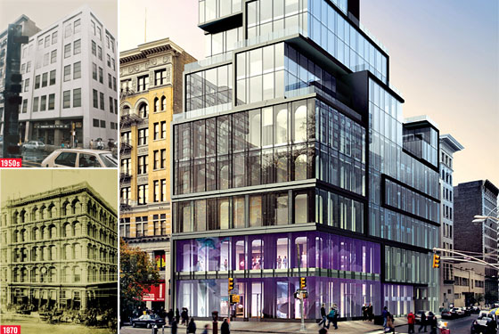

There have always been options for spiffing up a dowdy building: Add, eviscerate, or flay. The survivor at 15 Union Square West—which began life as Tiffany & Co.—has undergone all three. The 1870 cast-iron façade looked as if it would be there forever, with Italianate arches reminiscent of a merchant palazzo. In the 1950s, that dandyish exterior was covered with mild white brick, anonymously modern. Now the building is shedding that skin—and its identity as a bank—to be reborn as a condo. Bits of the Tiffany glory are reappearing, unfortunately only partly visible beneath outerwear of zinc and glass. It’s as if the architect, Eran Chen of Perkins Eastman, confronted with an aesthetic past he couldn’t quite recover, chose to stow it in a vitrine, treating it with irony, as an artifact.

**24. Alvin Ailey Dance Center**

405 West 55th Street

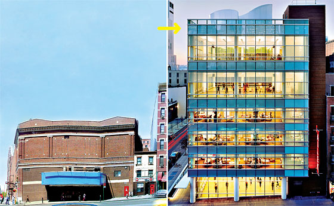

The glass-and-steel modernism powerfully erases the memory of the windowless bunker that was there before, but Iu & Bibliowicz’s design has had less impact than the antics of rubber-limbed dancers visible from the street. If only the shades weren’t drawn most of the time—anyone who likes to watch has to peek in at the corners, transforming the ideal of transparency into a form of voyeuristic lurking. A great swap.

**25. 1600 Broadway**

At 50th Street

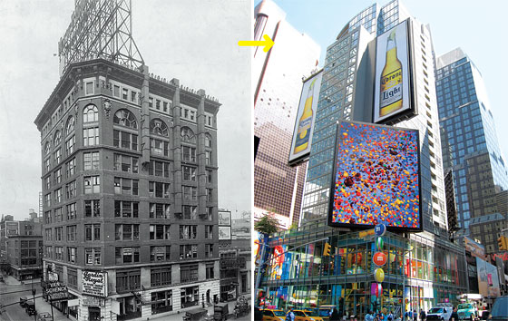

This lumbering, corporate-looking tower at the top of Times Square is really a stack of pieds-à-terre over an M&M’s emporium. With a midsection that looks as if it had been improperly screwed on and a giant billboard attempting to look inconspicuous, Einhorn Yaffe Prescott’s design tries too hard to be jaunty. It certainly doesn’t make up for the loss of the historic if sedate Studebaker Building, which at various times sheltered the car company, a Ripley’s Odditorium, and the birthplace of Columbia Pictures.

**26. 4 Times Square**

At 42nd Street

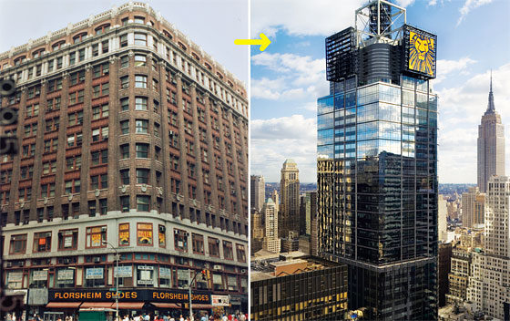

A dour, broad-shouldered office building and a Nathan’s Famous stood in the way of the glamorization of Times Square. Fox & Fowle’s handsome landmark for Condé Nast offered the neighborhood some much-needed architectural sophistication, as well as a nice gastronomic rejoinder to the wiener stand: Frank Gehry’s beautifully baroque cafeteria.

**27. Urban Glass House**

300 Spring Street

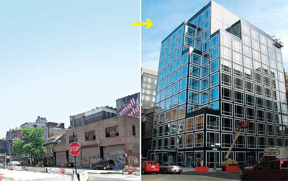

Philip Johnson’s finale isn’t his best work, but it’s still far better than you might expect directly across from a Holland Tunnel ventilation shaft. Transparency in an urban setting is double-edged, so the building’s windows are darkened, giving it the appearance of a high-end audio component. The area’s quick transition to fine living has made for a competitive climate in residential architecture. Generally a pleasing exchange.

**28. 40 Mercer Street**

At Grand Street

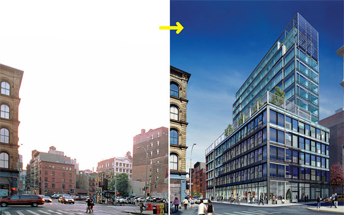

This is the best sort of metamorphosis: from a parking lot to a work of genuine architecture by Jean Nouvel. The frame updates Soho’s cast-iron context, and the red- and blue-tinted windows cast a slightly sacramental glow.

**29. Westin Hotel**

270 West 43rd Street

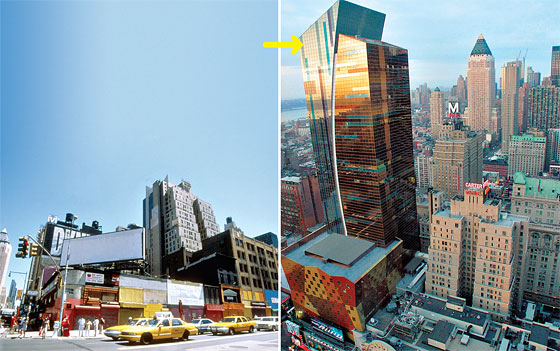

Rising on a site that desperately needed a jolt of personality, Arquitectonica’s hotel is what the French might call a jolie-laide, an ugly beauty—a dandy wearing too many plaids— and a nod to the theater district’s tradition of outlandishness. When the time comes to tear it down, watch the preservationists mobilize to hold on to some old-time eccentricity.

**30. Avalon Chrystie Place**

229 Chrystie Street

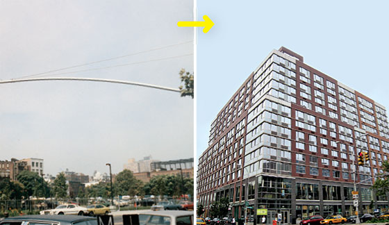

The staid developer AvalonBay recruited Arquitectonica and SLCE Architects to doll up its façade, and the result is a marriage of expediency and dullness. It has helped lift the neighborhood’s fortunes, but at what cost?

**31. 497 Greenwich Street**

At Spring Street

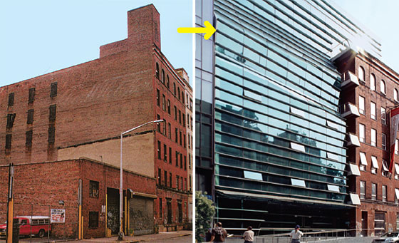

Winka Dubbeldam turned this little condo into an essay on the versatility of glass. Rather than aspire to seamlessness, she crumpled the curtain wall into folds. But it’s not radicalism for its own sake: the façade marries transparency with the textures of the masonry neighborhood.

**32. One Beacon Court/Bloomberg Tower**

731 Lexington Avenue

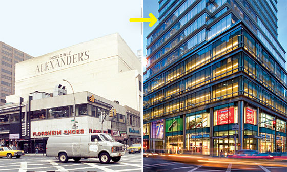

New Yorkers of a certain age have a soft spot for Alexander’s, the full-block department store that closed in 1992 and sat empty for years. But Cesar Pelli’s silvery skyscraper tops a fine oval court, its curve embracing the populace.

**33. Blue**

105 Norfolk Street

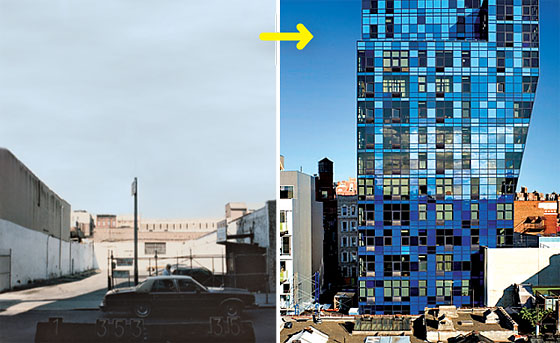

Some fancy new architecture was inevitable and even desirable here, and it’s not as if Bernard Tschumi’s baublelike condo displaced any gems. But from a certain angle, the swollen blue thing looks disconcertingly like … well, like a sore thumb.

**34. One York**

One York Street

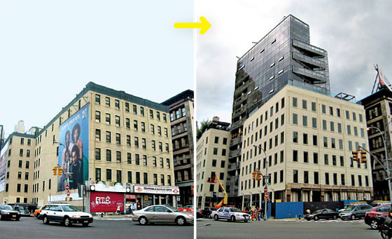

Enrique Norten has plunked a crystal castle on top of a pale Civil War-era warehouse. That’s an attractively old-world approach: Pile the present on top of the past, making each adapt to the other. The pleasures of Canal Street living are still a little elusive, though.

**35. Morgan Library and Museum**

225 Madison Avenue 

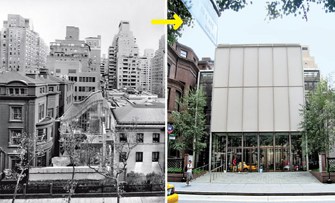

In rethinking the Morgan, Renzo Piano harmonized its disparate pieces with poetic rationalism. In keeping with the institution’s tranquil dignity, the additions make no hucksterish moves but manage to unify the old buildings while emphasizing their separateness.

**36. 80 Metropolitan**

80 Metropolitan Avenue, Williamsburg

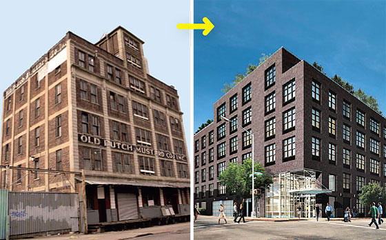

Rather than renovate, Steiner NYC tore down the rather fancy Old Dutch Mustard plant and worked up a new six-story residential complex, currently under construction. There is no evidence that it will be marvelous enough to take the bite out of the loss.

**37. Millenium Hilton**

55 Church Street

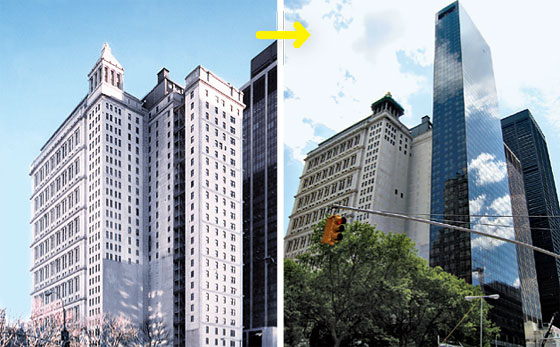

Instead of amicably rubbing shoulders with the 1916 AT&T building at 195 Broadway, Eli Attia’s 55-story black-glass financial-district hotel turns a cold shoulder to its stately blockmate. A little extra light and air on that street of skyscrapers was preferable.

**38. One Union Square South**

At Broadway

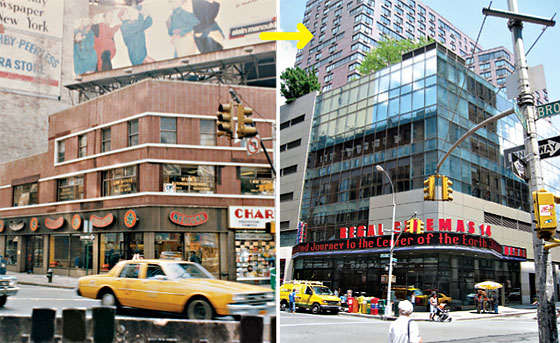

Davis Brody Bond’s apartments are basically a support for Metronome, the ever-puzzling steam-breathing artwork that tells time but remains silent about history. The legendary Union Square Theater stood on this site and should never have been allowed to rot.

**39. 100 Jay Street**

At York Street, Dumbo

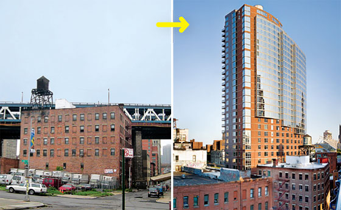

Gruzen Samton’s brick-and-glass gorilla, known as “J Condo,” demonstrates Dumbo’s crazy hypnotic power to draw buyers despite the bridge’s rumble. The tower looms over the neighborhood, inciting low buildings to rise up. Here’s hoping its call goes unheeded.

**40. Bronx Hall of Justice**

265 East 161st St., the Bronx

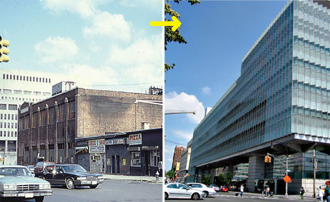

A row of small businesses gave way for Rafael Viñoly’s faceted glass courthouse, a spacious, sunlit space where jury duty is less of a trial. The real payoff is in the neighborhood’s rehabilitated image: Crystal palace replaces Fort Apache.

**41. New Museum of Contemporary Art**

235 Bowery

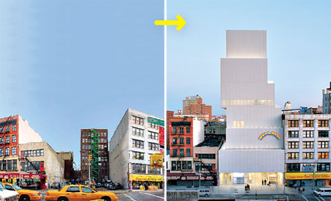

Simple and inviting on the street, the museum is more aggressive inside, where acres of fluorescent lights give the galleries a bleary, refrigerated feel. Inhabiting a long-vacant lot, Sanaa’s brilliant stack of boxes is perfect in what is—for now—a transitional zone.

**42. The Journeys of Columbus Circle**

The two blocks on the west side of Columbus Circle—from 58th to 60th Streets—have, over a century and a half, told New York’s development story in miniature. The site was first cleared as farmland (1), owned by one John Somerindyke, when this intersection of the Bloomingdale Road (later Broadway) and Eighth Avenue was the southern edge of the village of Harsenville. In the early 1890s, as brownstones and businesses were staking claims to the West Side, the crossroads was shaped into a circle with a monument to Christopher Columbus at its center.

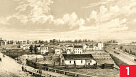

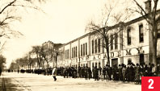

[Images from the New York Historical Society](https://cdm16694.contentdm.oclc.org/digital/collection/p16124coll2/search)

It took a while for the neighborhood to live up to its imagined grandeur. Durland’s Riding Academy (2) and another stable lined the sides of Broadway.

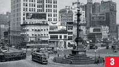

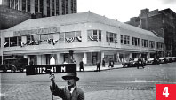

As the area developed, its dominant business became entertainment—theater at first, then movies. The Circle Theatre (3), a vaudeville-and-burlesque joint at 60th and Broadway, opened its doors in 1901, right where Jazz at Lincoln Center’s patron’s enter today. It lasted a good four decades, to be briefly replaced by a sweet little streamlined roller-skating rink (4). (Meanwhile, the district’s emphasis shifted from theaters to auto dealerships.)

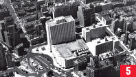

Then came Robert Moses’s big-think project, the New York Coliseum (5). Roman in scale (if not in spelling), it brought conventioneers by the trainload, ignored the city around it, and was not mourned one bit upon its demolition in 2000.

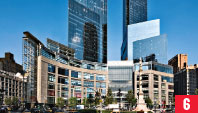

By then, developers had spent a decade making plays for the site—Mort Zuckerman memorably lost a big chunk of his $33.8 million deposit—and the winner was the Related Companies, which put up the Time Warner Center (6). The complex has turned out to be neither as monstrous nor as glamorous as the various factions anticipated. It efficiently satisfies deluxe desires—for quinoa salad, aromatherapy, boardrooms, park views, extra pillows, and more. As a money magnet, it’s a masterpiece; as architecture, it’s not half-bad.

**43. Cooper Square Hotel**

27 Cooper Square

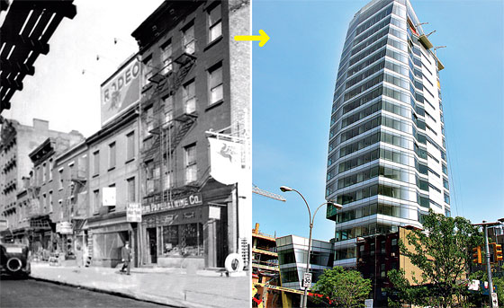

When tenants of a ramshackle four-story building refused to leave, Carlos Zapata simply sucked their homes into his design for the tower clad in milky glass. The result is an elegant building that makes a clumsy intrusion, like a well-dressed passenger on a crowded subway train, forcing his rear onto a too-small slice of seat. Such a radical neighborhood transformation needed more tenderness and care.

**44. The Lyric**

255 West 94th Street

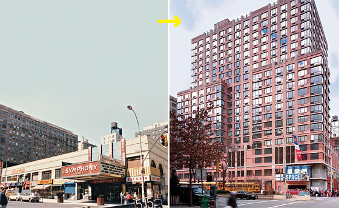

An eminently adequate block-long apartment building wraps itself around Symphony Space. Polshek Partnership’s renovation of that beloved but once-dilapidated venue is one of the best things to have happened to the neighborhood.

**45. Ten63**

10-63 Jackson Avenue, Long Island City

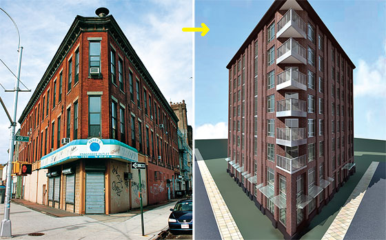

A preservation effort wasn’t enough to save the flatiron Hackett Building, a nineteenth-century red-brick pile that had once been Queens’s borough hall. It didn’t quite rise to landmark status, but the distinctive shape and green cornice should have conferred the staying power that an aging character enjoys. It seems unlikely that H. Thomas O’Hara’s eight-story condo Ten63 will be able to compete in the personality department.

**46. American Folk Art Museum**

45 West 53rd Street

The eight-story building, a luminous masterpiece by Tod Williams and Billie Tsien, has a bronze-alloy façade creased and cupped like a hand, and an angelic haze of daylight that pierces the glass ceiling. Worth the sacrifice of three battered townhouses.

**47. Ariel East and Ariel West**

2628 Broadway/245 West 99th Street

The landmarked Metro movie theater remains in façade only, crumbling and vacant. But the paired towers next to it and across the street are a nice surprise, adding variety to Broadway’s jagged profile.

**48. The Metropolitan**

181 East 90th Street

This bland luxury high-rise, designed by Philip Johnson in his dotage, cost New York four tenements and a handful of democratic local businesses, including the charming, tin-ceilinged Victory Café. The Metropolitan’s amenities, on the other hand, pamper residents only.

**49. Riverside South**

Riverside Boulevard, 59th to 72nd Streets

Donald Trump no longer has much to do with this palisade of apartments. Still, he retains the blame. The buildings aren’t terrible, and in theory it was a good idea to build over the tracks, but the plan yielded a forbidding wall severing the rest of the West Side from the river.

**50. Columbia University Lasker Biomedical Research Building**

3960 Broadway

After a big preservation fight, Davis Brody Bond saved portions of the Audubon Ballroom, where Malcolm X was killed, and restored the 1912 façade, gluing it all awkwardly to a glum block. A Pyrrhic victory.

**51. Columbia University School of Social Work**

1255 Amsterdam Avenue

Cooper Robertson’s blond masonry building at 122nd Street mitigates the effect of the oppressive wall that Columbia long ago built fronting the avenue, but it’s still pretty timid.

**52. Graceline Court**

106 West 116th Street

A condo has sprouted over the roof of Malcolm Shabazz Mosque No. 7. Arguably better than the vacant lot that was there before, but couldn’t Graceline Court have a more graceful line?

**53. 325 Fifth Avenue**

Near 32nd Street

To make room for Stephen Jacobs’s mutant tower, the developer scooped out the middle of the block. The collateral damage included a quaint red townhouse, its aspirations all out of proportion to its size. A textbook case of a street that lost texture and variety.

**54. Hearst Tower**

300 West 57th Street

The best work of corporate architecture to grace New York in decades, Norman Foster’s Hearst Tower negotiates deftly between its crystalline exoskeleton and the fanciful 1928 base by Joseph Urban. Turns out one era’s version of modernity can always talk to another’s.